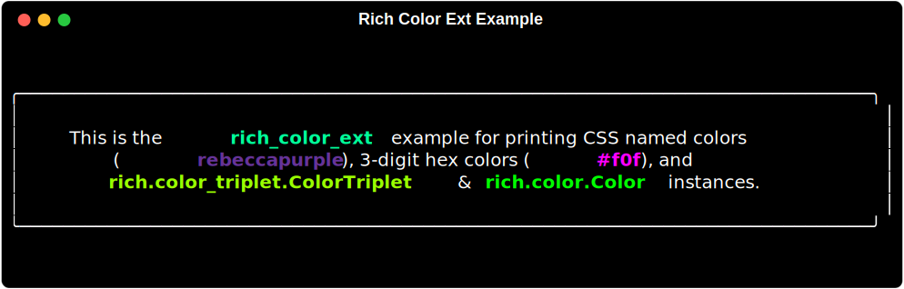

# rich-color-ext

`rich-color-ext` extends the great [rich](http://GitHub.com/textualize/rich) library to be able to parse 3-digit hex colors (ie. <span style="color:#09f">`#09F`</span>) and CSS color names (ie. <span style="rebeccapurple">`rebeccapurple`</span>).

## Installation

### uv (recommended)

```shell
uv add rich-color-ext
```

### pip

```shell
pip install rich-color-ext
```

## Usage

To make use of `rich-color-ext` all you need to do is import it.

```python
import rich_color_ext
from rich.console import Console

console = Console(width=80)
console.print(
    Panel(
        "This is the [b #00ff99]rich_color_ext[/b #00ff99] \
example for printing CSS named colors ([bold rebeccapurple]\
rebeccapurple[/bold rebeccapurple]), 3-digit hex \
colors ([bold #f0f]#f0f[/bold #f0f]), and [b #99ff00]\
rich.color_triplet.ColorTriplet[/b #99ff00] & [b #00ff00]\
rich.color.Color[/b #00ff00] instances.",
        padding=(1,2)
    ),
    justify="center"
)
```



Made by Max Ludden

<div style="text-align:center">
    
</div>
