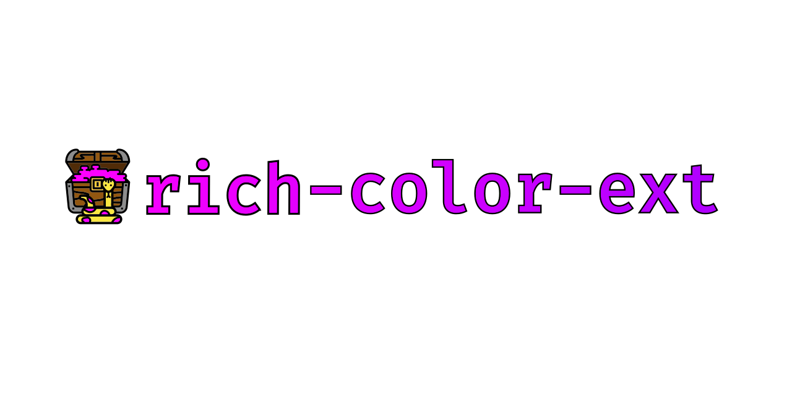
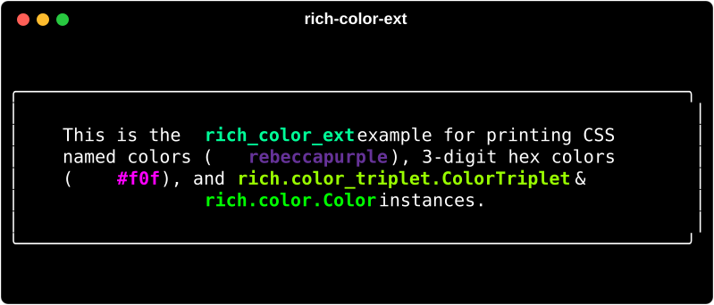

<h1 align="center" width="100%">
    <a href="https://GitHub.com/maxludden/rich-color-ext">
        
    </a>
</h1>

<p align="center">
  <a href="https://www.python.org/">
    </a>
  <a href="https://pypi.org/project/rich_color_ext/">
    </a>
  <a href="https://github.com/astral-sh/uv">
  </a>
</p>
<p align="center">
    <a href="https://github.com/maxludden/rich-color-ext/actions/workflows/docs-deploy.yml">
        </a>
    <a href="https://maxludden.github.io/rich-color-ext/"></a>
</p>

[`rich-color-ext`](https://GitHub.com/maxludden/rich-color-ext) extends the great [rich](http://GitHub.com/textualize/rich) library to be able to parse 3-digit hex colors (ie. <span style="color:#09f">`#09F`</span>, the `#` is required) and [CSS color names](https://www.w3.org/TR/css-color-4/#css-color) (ie. <span style="color:rebeccapurple;">`rebeccapurple`</span>).

`rich-color-ext` parses with Rich's own `Color.parse` **first** and only falls back to `rich-color-ext` when Rich fails (raises `ColorParseError`). Everything Rich already understands (including ANSI names like `red`) behaves exactly as before; the extensions only fill in what Rich rejects.

> Warning: **Breaking changes in v3.0.0**
>
> - Rich's parser now runs **first**; CSS names and 3-digit hex are only a fallback for colors Rich rejects. Names Rich already knows (`red`, `green`, `white`, `orchid`, ...) keep Rich's own color instead of the CSS truecolor value.
> - 3-digit hex requires the leading `#` (`#09f`, not `09f`).
> - The import-time `CSS_MAP` constant was removed. Use `get_css_map()` instead.
>
> See the [changelog](CHANGELOG.md) for details.

## Installation

### [uv](https://docs.astral.sh/uv/) (recommended)

```shell
# via uv directly
uv add rich-color-ext
```

or

```shell
# or via pip through uv
uv pip install rich-color-ext
```

### [pip](https://pypi.org/project/rich-color-ext/)

```shell
pip install rich-color-ext
```

## Usage

To make use of [`rich-color-ext`](https://pypi.org/project/rich-color-ext/) all you need to do is import and install it at the start of your program:

```python
from rich_color_ext import install
from rich.console import Console
from rich.panel import Panel

install()  # Patch Rich's Color.parse method

console = Console(width=64)
console.print(
    Panel(
        "This is the [b #00ff99]rich_color_ext[/b #00ff99] example for printing CSS named colors ([bold rebeccapurple]rebeccapurple[/bold rebeccapurple]), 3-digit hex colors ([bold #f0f]#f0f[/bold #f0f]), and [b #99ff00]rich.color_triplet.ColorTriplet[/b #99ff00] & [b #00ff00]rich.color.Color[/b #00ff00] instances.",
        padding=(1, 2),
    ),
    justify="center",
)
```



### How it works

1. `Color.parse(text)` calls Rich's original parser first. If Rich can parse the text, that result is returned unchanged.
2. Only if Rich raises `ColorParseError` does `rich-color-ext` try its own parsing: `#abc` is expanded to `#aabbcc`, or the text is looked up (case-insensitively) in the CSS color map.
3. If `rich-color-ext` can't parse it either, Rich's original `ColorParseError` is re-raised.

Results are cached with `functools.lru_cache`, like Rich's own parser.

> Note: this Rich-first order applies to `Color.parse` (and so to everything Rich parses through it, such as styles and markup). `get_css_map()` and the `CSSColor` helpers don't consult Rich: `get_css_map()["red"]` is the CSS hex `#ff0000`, while `Color.parse("red")` is Rich's ANSI `red`.

### Install, uninstall and inspect

```python
from rich_color_ext import get_css_map, install, is_installed, uninstall

install()  # safe to call more than once, and from multiple threads
assert is_installed()

get_css_map()["rebeccapurple"]  # '#663399'

uninstall()  # restores Rich's original Color.parse exactly
```

- Importing `rich_color_ext` has no side effects: nothing is patched until you call `install()`, and the display-only Rich modules (`Panel`, `Table`, `Columns`) are loaded lazily.
- `install()` / `uninstall()` are serialised with a lock, and `is_installed()` inspects `Color.parse` itself.
- The patch is installed as a `classmethod`, like Rich's own, so `Color.parse(...)` works on a `Color` instance and `MyColor.parse(...)` on a `Color` subclass returns a `MyColor`.

### Migrating from v2

| v2 | v3 |
| --- | --- |
| `Color.parse("red")` → CSS truecolor `#ff0000` | Rich's ANSI `red` (Rich wins) |
| `Color.parse("09f")` → `#0099ff` | `ColorParseError`; use `#09f` |
| `from rich_color_ext import CSS_MAP` | `from rich_color_ext import get_css_map` |

<p style="text-align:center;">
    <a href="https://github.com/maxludden/rich-color-ext"><code>rich-color-ext</code> by Max Ludden</a>
</p>

<div style="text-align:center">
    <a href="https://github.com/maxludden/rich-color-ext">
        
    </a>
</div>
